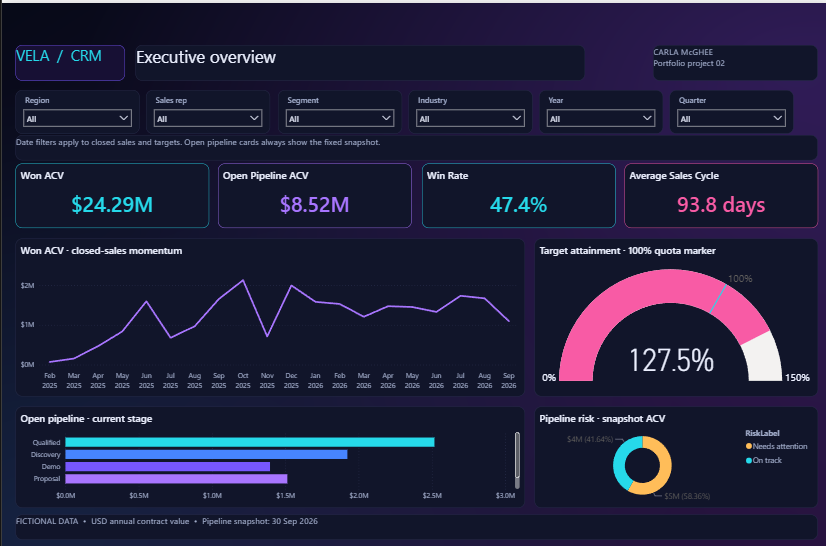
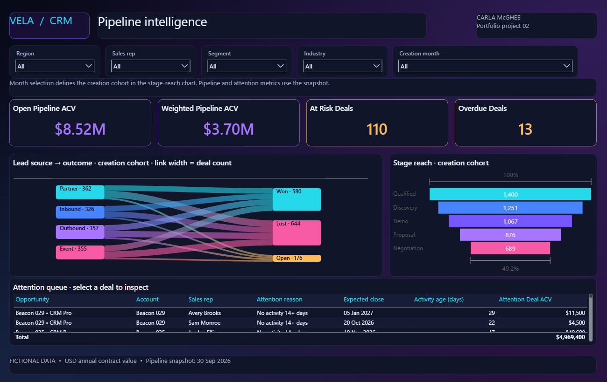

# Vela CRM · Sales Command Center

A Power BI portfolio project by Carla McGhee. A dark neon theme uses cyan, violet, pink, and amber on midnight surfaces with high-contrast labels. Four interactive report pages turn fictional CRM opportunity, stage-history, activity, and target data into sales performance and pipeline insights.





**Status:** Opened and reviewed in Power BI Desktop. Baseline totals, 2026 Q3 sales results, rep filtering, and account drill-through were checked against the fictional source data. Report definitions were checked for schema compatibility and bindings. These screenshots show the actual Desktop report. Service deployment and scheduled refresh have not been tested.

## Open locally

1. Download the ZIP and choose **Extract All** in Windows. Keep the entire folder together.
2. Open **VelaCRM.pbip** inside the extracted folder with the current Power BI Desktop.
3. If Windows does not recognize `.pbip`, open Power BI Desktop and use **File → Open** to select it. If project support is disabled in an older Desktop build, update Desktop and check its project/developer format settings.
4. Choose **Refresh**. The model contains embedded fictional data, so there is no source path, credential, or gateway to configure.
5. Check the baseline cards against `docs/expected-results.json` and follow `docs/uat.md`.
6. Save your working copy. Share screenshots only after Desktop rendering has been verified.

No Power BI service publication is required to use the report locally.

## Report pages

| Page | Decisions supported |
| --- | --- |
| Executive overview | Closed sales performance, win rate, targets, open pipeline, and risk exposure |
| Pipeline intelligence | Stage reach for creation cohorts, weighted snapshot pipeline, and an attention queue |
| Sales performance | Rep outcomes, contract size, sales cycle, and won ACV versus monthly quota |
| Account detail | Account opportunity history and current open pipeline; account slicer and drill-through definition |

Native visuals, dropdown slicers, chart sorting, account drill-through metadata, model relationships, reusable DAX, a custom theme, and readable source files are included. The graphics revision adds a filter-responsive source-to-outcome SVG flow in a native table, a creation-cohort funnel, a quota gauge, a risk donut, and a rep-performance bubble chart. The SVG responds to external filters; its links are not independently selectable. Year/quarter and rep slicers, and account drill-through, were exercised in Desktop. Page tabs provide navigation; custom bookmarks, custom tooltip pages, RLS, service refresh, and forecasting models are outside this first version.

## What makes the metrics meaningful

- Won ACV is annual contract value booked when an opportunity closes won. It is not recognized revenue.
- Win rate is won / (won + lost); open deals are excluded.
- Closed sales use actual close date. The current pipeline is a fixed snapshot on **30 September 2026**, not a historical pipeline reconstruction.
- Pipeline measures ignore Date filters but respect applicable account, rep, region, and stage filters.
- Stage reach uses stage-history records for opportunities created in the selected period. It is not a funnel inferred from current stage counts.
- Weighted pipeline is a heuristic amount × stage probability, not a calibrated revenue prediction.
- Targets are at rep/month grain. Attainment is blank for account, segment, industry, lead-source, product, or stage filters that the target data cannot support.

## Data and reproducibility

- 1,400 opportunities, 180 accounts, 12 sales reps
- 5,283 stage-history intervals, 1,400 last-activity records
- 24 months of monthly rep targets; future target months are excluded from target metrics
- Calendar: January 2025–December 2026; activity/opportunity snapshot: September 2026
- Seed: 3387; all names and values are fictional

`data/` contains human-readable CSV exports. The portable model embeds the same rows in M partitions. Editing a CSV alone does not change the report: rebuild the project to re-embed changed source data. The generator reproduces the demonstration dataset. The checked-in report includes subsequent Desktop formatting edits; running the builder overwrites those report edits. Copy the project before rebuilding.

```sh
python tools/build_project.py
python tools/validate_project.py
python tools/render_flow_preview.py
```

The builder uses Python and Pillow for the ombré background. Validation requires `jsonschema`; preview rendering requires `matplotlib`. See `requirements-dev.txt`.

See [metric definitions](docs/metric-definitions.md), [model notes](docs/model.md), and [UAT](docs/uat.md).

## Power BI source format

`VelaCRM.pbip` references `VelaCRM.Report` and `VelaCRM.SemanticModel`. The report uses public PBIR JSON definitions. The semantic model uses `model.bim` and M import partitions. Microsoft format documentation:

- https://learn.microsoft.com/en-us/power-bi/developer/projects/projects-overview
- https://learn.microsoft.com/en-us/power-bi/developer/projects/projects-report
- https://learn.microsoft.com/en-us/power-bi/developer/projects/projects-dataset

Microsoft JSON schemas are vendored under `tools/schemas` with their MIT license for reproducible offline validation.

## Portfolio scope

An independently designed personal project, using synthetic data and a fictional software-sales scenario. It contains no employer CRM data, client information, or proprietary configuration. Intended to demonstrate requirements translation, semantic modeling, DAX, report design, and validation.
